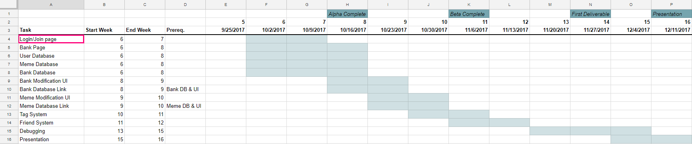

# 4.0 Software Development Plan

## 4.1   Plan Introduction

This Software Development Plan (SDP) provides the details of the planned development for the Web Application Memebank, which provides a personal online database and social media platform that allows users to store, sort, and share links to their favorite memes.

Memebank's primary function is to store users' links in a database. Through its web application, Memebank will provide users with an interactive visualization of the content of these links. Memebank will have various features to satisfy users' desires to keep and organize their memes. Functionalities to serve this purpose include link sorting via a tag system, grouping system that called banks that serves as a folder for memes, and link sharing via social media outlets. Memebank allows users to easily and quickly access their memes at any time from their laptop on a web browser. In 2017, where memes are in frequent demand and usage memebank can provide a specialized, simple, and appropriate service that many online users want.

During our 16 week development process, our team will continously plan and update with each other using the memebank discord channel and github. In order to affectively develope memebank, our team will research and learn any necessary tools. The Memebank system architecture is comprised of a React.js graphical user interface, a Ruby on Rails server, and a SQLite database. In addition to class meetings every Wednesdays, subteams such as frontend and backend team will meet up to work on the development schedule as follows.

| Function / Feature | Due Date |
|---|---|
| Login/Join Authentication Page | Week 7 |
| Bank Page | Week 8 |
| Bank Database | Week 8 |
| Meme Database | Week 8 |
| User Database | Week 8 |
| Bank Modification UI | Week 9 |
| Bank Database Link | Week 9 |
| Meme Modification UI | Week 10 |
| Meme Database Link | Week 10 |
| Tag System | Week 11 |
| Friend System | Week 12 |
| Debugging | Week 15 |
| Presentation | Week 16 |

- 4.1.1 Project Deliverables
  - Alpha (10/16/2017) - The alpha version of Memebank will aim to have all core functionalities working and ready to go. Core functionalities include logging in/joining and storing links (memes).
  - Beta (11/06/2017) - The beta version of Memebank should have most features working both with our designed user interface and its backend. The tagging system will be left for the next deliverable. Multiple testing will be done between the beta release and the next release.
  - Version 1.0 (11/27/2017) - Version 1.0 will include all features, including the tagging system. Version 1.0 should also little to no bugs.

## 4.2   Project Resources

- 4.2.1 Hardware Resources

| Resource | Development | Execution |
|---|---|---|
| Macbook/Windows Computer | ✓ | ✓ |
| Intel HD Graphics 4600 Graphics Card | ✓ | ✓ |
| 8 GB RAM | ✓ | ✓ |
| Internet Connectivity | ✓ | ✓ |
| 16 GB Storage | ✓ | ✓ |

- 4.2.2 Software Resources

|Resource              | Development   | Execution  |
|--------------------- | ------------- | -----------|
|Google Chrome         | ✓             | ✓         |
|Atom Text Editor      | ✓             |            |
|Ruby on Rails         | ✓             |            |
|React.js              | ✓             | ✓         |
|macOS                 | ✓             | ✓         |
|Windows OS            | ✓             | ✓         |
|GitHub                | ✓             |           |
|SQLite                | ✓             |           |

## 4.3   Project Organization

Our team is organized into sub-groups, each with individual tasks. The groups are listed below with their corresponding responsibilities.

| Name | Team | Role |
|---|---|---|
| Anthony Herco | Backend, Frontend, Database | Project Manager |
| Jen Shin| Backend, Frontend, Database | Backend support/Frontend support/Database support |
| Mitchell Simon| Backend, Database| Backend/Database leader |
| Jay Patel | Backend, Frontend | Backend support/Frontend support |
| Elizabeth Shen | Backend, Frontend| Backend support/Frontend support |
| Daniel Sjarif | Frontend | Frontend leader |
| Arash Lari | Frontend | Frontend support |

## 4.4   Project Schedule

- 4.4.1 PERT / GANTT Chart

- 4.4.2 Task / Resource Table

| Project Deliverables | Members | Hardware | Software |
|---|---|---|---|
| Login/Join Authentication Page | Elizabeth Shen, Jay Patel, Jen Shin, Anthony Herco | Macbook/Windows PC | Ruby on Rails |
| Home Page | Jay Patel, Elizabeth Shen, Jen Shin, Anthony Herco | Macbook/Windows PC | ReactJS, css |
| Bank Page | Daniel Sjarif, Anthony Herco | Macbook/Windows PC | ReactJS, css |
| Bank Database | Jen Shin, Mitchell Simon, Elizabeth Shen, Anthony Herco | Macbook/Windows PC | Ruby on Rails |
| Meme Database | Jen Shin, Mitchell Simon, Elizabeth Shen, Anthony Herco | Macbook/Windows PC | Ruby on Rails |
| User Database | Jen Shin, Mitchell Simon, Elizabeth Shen, Anthony Herco | Macbook/Windows PC | Ruby on Rails |
| Bank Modification UI | Anthony Herco, Daniel Sjarif, Arash Lari | Macbook/Windows PC | ReactJS, css |
| Bank Database Link | Jay Patel, Elizabeth Shen, Mitchell Simon, Anthony Herco | Macbook/Windows PC | ReactJS, css |
| Meme Modification UI | Anthony Herco, Daniel Sjarif, Arash Lari | Macbook/Windows PC | ReactJS, css |
| Meme Database Link | Jay Patel, Elizabeth Shen, Mitchell Simon, Anthony Herco | Macbook/Windows PC | Javascript |
| Tag System | Anthony Herco, Arash Lari | Macbook/Windows PC | ReactJS, Ruby on Rails |
| Friend System | Anthony Herco, Arash Lari | Macbook/Windows PC | ReactJS, Ruby on Rails |
| Debugging | Entire Team | Macbook/Windows PC | Selenium, ReactJS|
| Presentation | Entire Team | Macbook/Windows PC | PowerPoint |

- 4.4.3 Class Schedule (optional)
