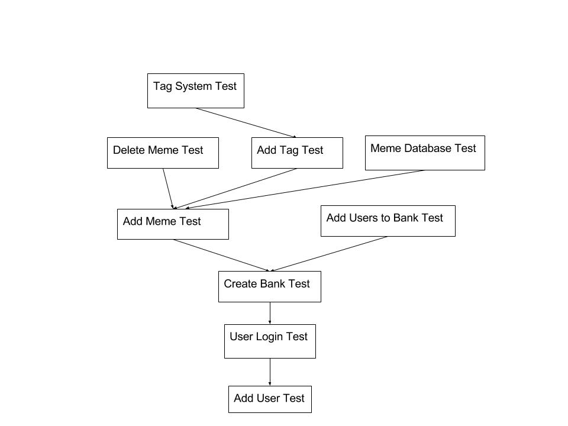

# 10.0 Testing

## 10.1 Unit Test Plan
- 10.1.1 Unit Test Descriptions
  - 10.1.1.1 Unit Test 1 - Add User Test-- This test will make sure that a user can successfully create a new profile and make sure it is in the user database.
  - 10.1.1.2 Unit Test 2 - User Login Test -- This test will make sure an existing user can successfully sign into their memebank.
  - 10.1.1.3 Unit Test 3 - Create Bank Test -- Test to make sure the user can create multiple banks.
  - 10.1.1.4 Unit Test 4 - Add Users to Bank Test -- Make sure when creating a bank it allows the user to add other users to their bank.
  - 10.1.1.5 Unit Test 5 - Add Meme Test -- This test will make sure the user can add their meme to their bank and view it properly.
  - 10.1.1.6 Unit Test 6 - Add Tags Test -- Make sure that memes have the specified tags when given said values.
  - 10.1.1.7 Unit Test 7 - Tag System Test -- This test will make sure when clicking a tag it will show the tags
  - 10.1.1.8 Unit Test 8 - Meme Database Test -- When adding an meme to a users bank it will make sure that the meme is in a database.
  - 10.1.1.9 Unit Test 9 - Delete Meme Test - This test will make sure that when a user delete it updates properly and gets rid of the meme from view, database, and the tags are removed as well if it is the only photo in that tag.

## 10.2 Integration Test Plan
  - 10.2.1 Integration Test Descriptions
    -  10.2.1.1  Integration Test 1 - Add User Test Integration -- When this test is run, the user will create a new profile and an error will be thrown if the profile is not successfully created.
    - 10.2.1.2 Integration Test 2 - User Login Test -- This test will throw an error if the user is not able to login to their profile.
    - 10.2.1.3 Integration Test 3 - Create Bank Test -- The test will throw an error if the user cannot make multiple banks or have an initial bank on logging in.
    - 10.2.1.4 Integration Test 4 - Add Users to Bank Testing -- This test will throw an error if a user or users cannot be added to a bank.
    - 10.2.1.5 Integration Test 5 - Add Meme Test -- This will throw an error if a link is unable to be added to the bank. It will also check to make sure that the uploaded link is an image/video/gif. An error will be thrown if a link that is not an image/video/gif is successfully uploaded.
    - 10.2.1.6 Integration Test 6 - Add Tags Test -- This test will throw an error if tags are unable to be added to a current bank.
    - 10.2.1.7 Integration Test 7 - Tag System Test -- When clicking on a specific tag, the memes from the current bank that fall under that tag will populate the current bank.
    - 10.2.1.8 Integration Test 8 - Meme Database Test -- This test will add a url to a specific bank, and then check to see if the meme was successfully added, otherwise an error will be thrown.
    - 10.2.1.9 Integration Test 9 - Delete Meme Test -- This test will make sure that a meme is no longer in the database or front end after it is removed. If the meme still appears then an error will be thrown.

## 10.3 Module Dependencies

